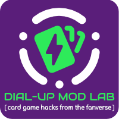

# Back of the Lab

**The filing cabinets had to go somewhere**. Here you'll find credits and acknowledgements for resources used in **Dial-Up Mod Lab** branding, graphics and other general materials, along with other bits and pieces from around the Lab.

The actual experiments, variants and projects have their own credits, acknowledgements, copyright notices and licence information on their respective project pages.

## Credits

Unless otherwise stated, Dial-Up Mod Lab branding and general creative material is designed and produced by [@56kBeard](https://linktr.ee/56kBeard)

Dial-Up Mod Lab branding and projects may include third-party publicly available resources. Where applicable, these are credited in line with their respective licence terms - thanks to the creators for making them available.

Project specific credits, copyright, licensing and attribution are provided with the relevant project and may appear on the project page or with the project materials rather than in this repository.

### Promo Artwork Credits

[**NS Motherboard**](https://boardgamegeek.com/filepage/328196)
- [D20 Charging Station promo](https://boardgamegeek.com/image/9792090) (Sep 26) Incorporates ‘Lighting and Thunderstorm’ #48844960 by irnanhs / vecteezy.com (Vecteezy Free License).

### General Credits

**Dial-Up Mod Lab logo**
- ICONS: Incorporates selected icons from tabler.io (MIT).
- FONTS: Audiowide, Comfortaa (SIL Open Font License).

## Small Print
Dial-Up Mod Lab is an independent, fanmade, non-commercial project space - helping the community get games to the table. Dial-Up Mod Lab is not affiliated with, endorsed by, or sponsored by any referenced game publishers or rights holders.   

  

© 2026 <a href="https://linktr.ee/DialUpModLab" target="blank">Dial-Up Mod Lab</a>. All rights reserved.

